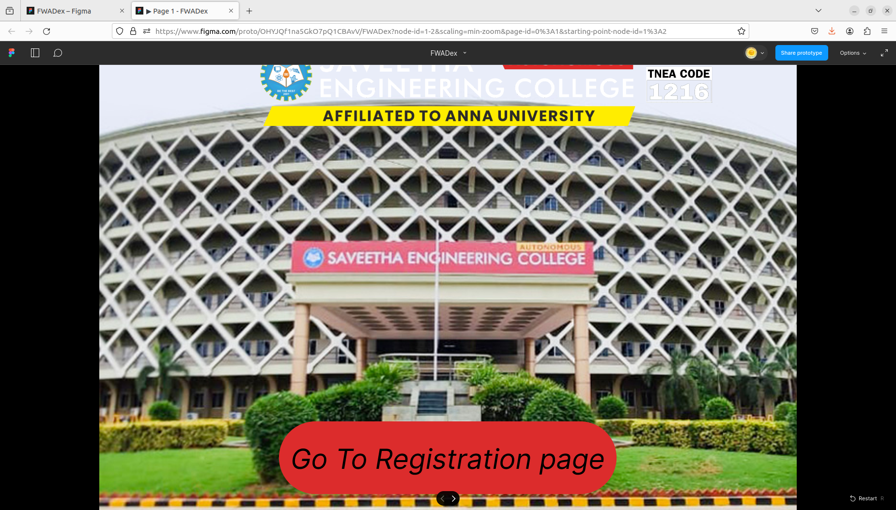
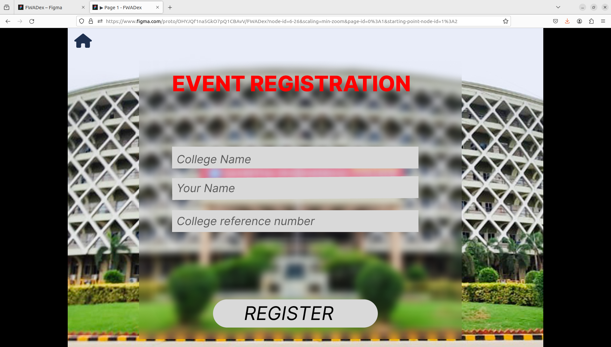
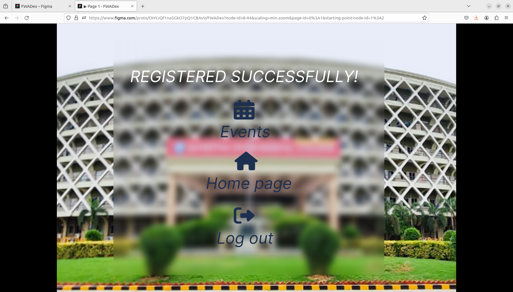
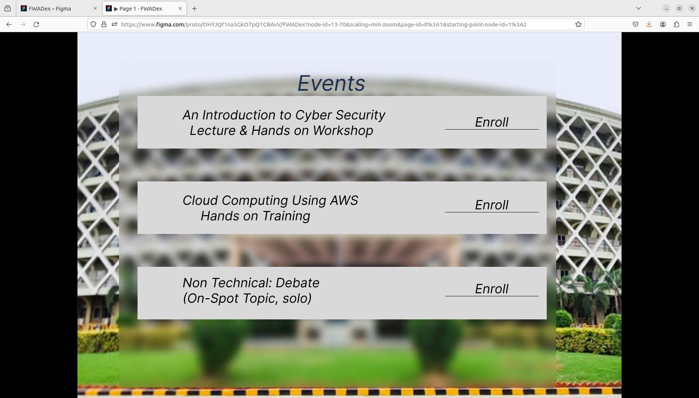
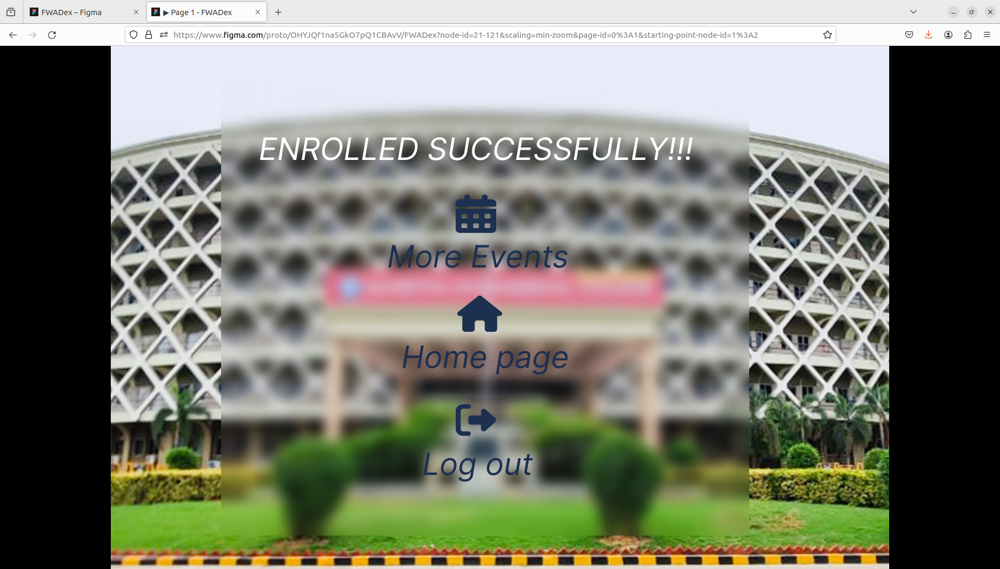

# Event Registration Web Application

## AIM:
To design, develop and deploy a web application for event registration.

## DESIGN STEPS:

### Step 1:
Create number of pages as needed

### Step 2:
Design the web pages

### Step 3:
Create HTML and CSS codes for the web pages

### Step 4:
Add the needed images for web pages

### Step 5:
Add styles for webpages

### Step 6:

Validate the HTML and CSS code.

### Step 7:

Publish the website in the given URL.

## DESIGN:

## PROGRAM :

    /* Background photo */
    width: 1440px;
    height: 1036px;
    flex-shrink: 0; 

    /* Saveetha Engineering college logo */
    width: 775px;
    height: 158px;
    flex-shrink: 0;
    background: url(<sec.png>), lightgray 50% / cover no-repeat;

    /* TNEA code 1216 */
    width: 204px;
    height: 190.614px;
    flex-shrink: 0;
    background: url(</home/sec/FWAD/ex09/event-registration/1216a.png>), lightgray 50% / cover no-repeat;

    /* Rectangular box - 1 */
    width: 697px;
    height: 150px;
    flex-shrink: 0;
    border-radius: 76px;
    background: #DC2C2C;

    /* Go To Registration page */
    color: #000;
    text-align: center;
    font-family: Inter;
    font-size: 57px;
    font-style: italic;
    font-weight: 400;
    line-height: normal;

    /* Home Icon */
    width: 53px;
    height: 43px;
    flex-shrink: 0;

    /* Blurred Box */
    width: 977px;
    height: 845px;
    flex-shrink: 0;
    background: rgba(217, 217, 217, 0.01);
    box-shadow: -60.733px 60.733px 60.733px 0px rgba(255, 255, 255, 0.01) inset, 60.733px -60.733px 60.733px 0px rgba(165, 165, 165, 0.01) inset;
    backdrop-filter: blur(12.146666526794434px);

    /* Rectangular Box 2 */
    width: 746px;
    height: 66.256px;
    flex-shrink: 0;
    fill: #D9D9D9;

    /* College Name- Detail */
    width: 226px;
    height: 41.792px;
    flex-shrink: 0;
    color: rgba(0, 0, 0, 0.58);
    font-family: Inter;
    font-size: 34px;
    font-style: italic;
    font-weight: 400;
    line-height: normal;

    /* Your Name - Detail */
    width: 177px;
    height: 41.792px;
    flex-shrink: 0;
    color: rgba(0, 0, 0, 0.58);
    font-family: Inter;
    font-size: 34px;
    font-style: italic;
    font-weight: 400;
    line-height: normal;

    /* College Reference Number - Detail */
    width: 427px;
    height: 42px;
    flex-shrink: 0;
    color: rgba(0, 0, 0, 0.58);
    font-family: Inter;
    font-size: 34px;
    font-style: italic;
    font-weight: 400;
    line-height: normal;

    /* REGISTER button */
    width: 429px;
    height: 70.333px;
    flex-shrink: 0;
    color: #000;
    text-align: center;
    font-family: Inter;
    font-size: 57px;
    font-style: italic;
    font-weight: 400;
    line-height: normal;

    /* Rectangle 3 */
    width: 499px;
    height: 85.623px;
    flex-shrink: 0;
    fill: #D9D9D9;

    /* Registered succesfully */
    width: 1107px;
    height: 157px;
    flex-shrink: 0;
    color: #FFF;
    text-align: center;
    font-family: Inter;
    font-size: 57px;
    font-style: italic;
    font-weight: 400;
    line-height: normal;

    /* Event, Home page, Log out, More events text css */
    color: #1E3050;
    text-align: center;
    font-family: Inter;
    font-size: 57px;
    font-style: italic;
    font-weight: 400;
    line-height: normal;

    /* Event Names - css */
    color: #000;
    font-family: Inter;
    font-size: 34px;
    font-style: italic;
    font-weight: 400;
    line-height: normal;

    /* enroll */
    color: #000;
    font-family: Inter;
    font-size: 34px;
    font-style: italic;
    font-weight: 400;
    line-height: normal;

## OUTPUT:

## Result:
The program to design , develop adn deploy a web application for event registration is completed successfully.
